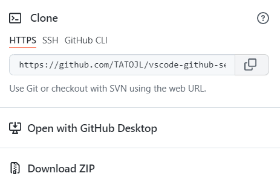
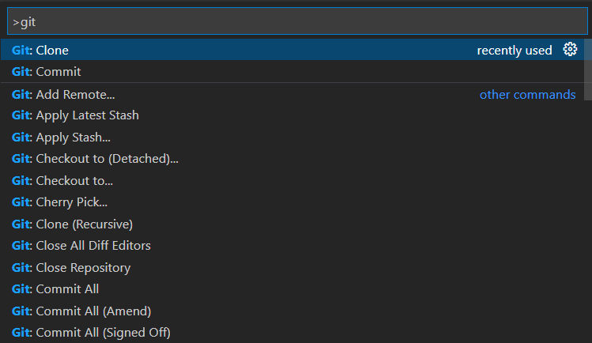
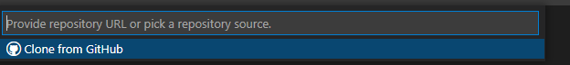
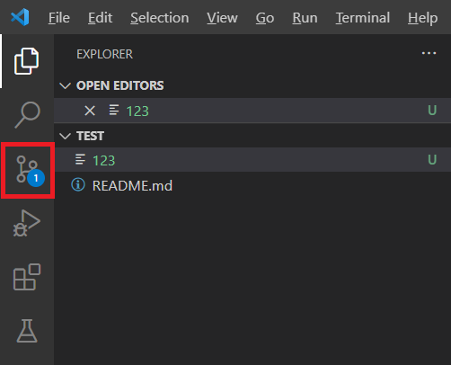
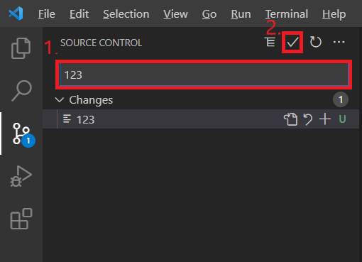
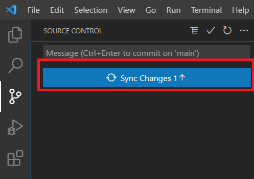

# vscode-github-settings #

安裝git
--------------- 
[git下載連結](https://git-scm.com)

檢查git版本，開啟終端機輸入:
```shell 

  git --version

```
  

## 登入/註冊github ##
[github連結](https://github.com)  

新增或開啟一個repository，並複製repository的連結

 

## 下載vscode後，啟動vscode ##

[vscode下載連結](https://code.visualstudio.com)

按f1輸入: __git clone__

  

貼上github repository的連結到vsocde   



選擇要存放的資料夾 

## 輸入github帳號與信箱 ##

啟動vscode的終端機(ctrl+shift+`)輸入:  

```shell

 git config --global user.name "帳號"    

```
```shell

 git config --global user.email "信箱"

```

上傳資料到github repository
----

有改動資料的話git的圖示會顯示更新




1.描述更改內容  
2.commit



完成同步上傳(github)跟下載(本地資料)

