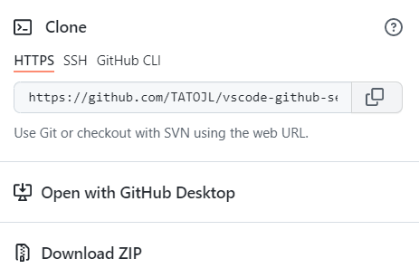
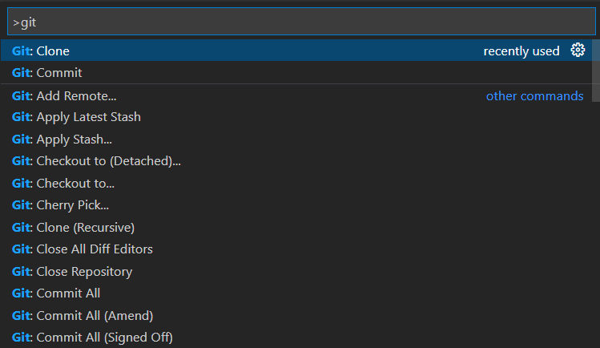
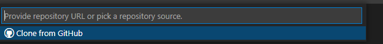

# vscode-github-settings #

## 安裝git ##
[git下載連結](https://git-scm.com)
## 檢查git版本，開啟終端機輸入: ##
__git --version__  
## 登入/註冊github ##
[github連結](https://github.com)  
新增或開啟一個Repository，並複製Repository的連結
  
## 下載vscode後，啟動vscode ##
[vscode下載連結](https://code.visualstudio.com)  
按f1輸入 __git clone__
  
貼上github Repository的連結到vsocde   
  
選擇要存放的資料夾  
## 輸入github信箱與帳號 ##
啟動vscode的終端機(ctrl+shift+`)輸入:  
__git config --global user.name "帳號"__    
__git config --global user.email "信箱"__